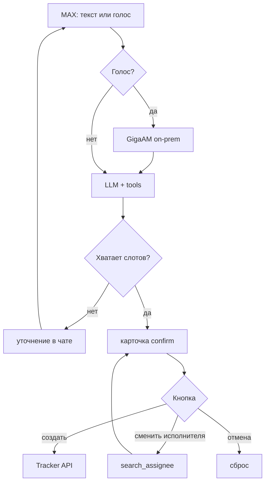

# Architecture

## Оригинал (прод)

Бот в MAX: пользователь пишет текстом или кидает голосовое → агент собирает задачу → показывает карточку → только после «Создать» уходит в Яндекс Трекер.

```text
MAX (webhook)
  → проверка secret / auth
  → голос → GigaAM (GPU, on-prem) → текст
  → локальная LLM + tools
  → карточка в чате MAX
  → по кнопке: создать / сменить исполнителя / отмена
  → create → Yandex Tracker API (реальный issue)
```

Как идёт диалог:

1. Сообщение приходит на webhook MAX (с секретом).
2. Если голос — GigaAM на своей машине, наружу аудио не уходит.
3. LLM через tool-calling: `search_assignee`, `parse_deadline`, `draft_task`, при необходимости `ask_clarification`.
4. Исполнителей берёт только из орг-словаря, логины не выдумывает.
5. Перед созданием — `confirm_draft`: карточка с названием, описанием, исполнителем, сроком.
6. Кнопки: создать / сменить исполнителя / отмена.
7. `create_task` без подтверждения не вызывается.
8. Сессия пользователя (черновик, шаги) — в Redis.
9. После создания можно комментировать и двигать срок (`add_comment`, `update_deadline`).

Зоны в проде:

| Зона | Что |
|------|-----|
| MAX | webhook + кнопки в чате |
| Агент | FastAPI, сессии Redis, tools |
| Инференс (LAN) | GigaAM, локальная LLM |
| Учёт | Yandex Tracker API |

Данные задачи и голос остаются во внутреннем контуре.



## Этот репозиторий — демо

Здесь не прод-бот, а разбор логики и контракта тулов без секретов и без живого MAX/Трекера.

| В оригинале | В этом демо |
|-------------|-------------|
| webhook MAX + auth | `POST /demo/chat` и `bot/demo_cli` |
| LLM tool-calling | эвристики в `agent/loop.py` (тот же набор тулов) |
| реальный Tracker | dry-run, ключи вроде `DEMO-1` |
| орг-справочник | `data/assignee_org_aliases*.json` (фейковые люди) |
| Redis | словарь в памяти процесса |
| GigaAM на GPU | адаптер есть, в демо можно stub |

Общее с продом: порядок шагов и правило «без confirm задачу не создаём» — то же самое в `tools/`.

Запуск демо: CLI или `/demo/chat`. Секреты только в локальном `.env`, в git их нет.

## Тулы

Хендлер в `tools/tracker_tools.py` → `TOOL_SPECS` / `get_tool_handlers` → тест в `tests/`.
