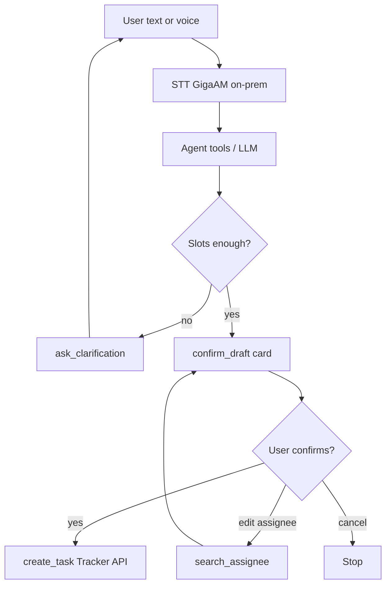

# Architecture

## Confirmation gate (required)

Production bot already has this UX. This repo keeps the same contract in the tool layer: `create_task` fails unless confirmed.

## Trust boundaries

| Zone | Components |
|------|------------|
| Messenger | MAX webhook (auth via secret) |
| Agent runtime | FastAPI, session, tools |
| Inference (LAN) | GigaAM STT, local LLM |
| Systems of record | Yandex Tracker API |

Audio and task text are processed inside the perimeter; they are not sent to public cloud STT/LLM APIs.

## Extending tools

Add a handler in `tools/tracker_tools.py`, register it in `TOOL_SPECS` and `get_tool_handlers`, cover with a unit test in `tests/`.
